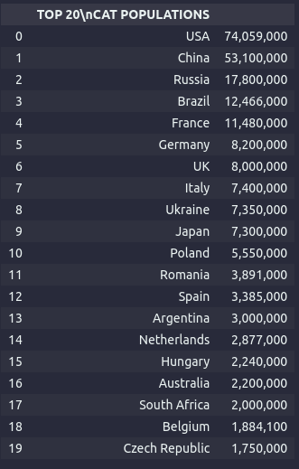
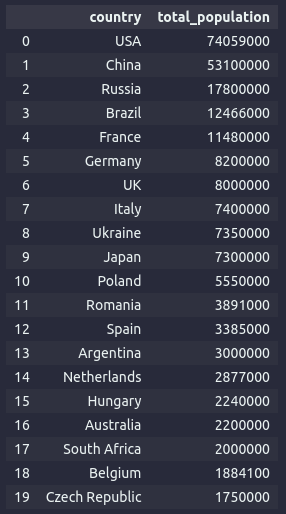
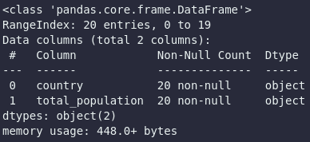
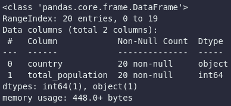
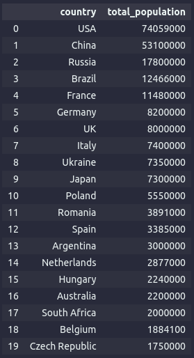
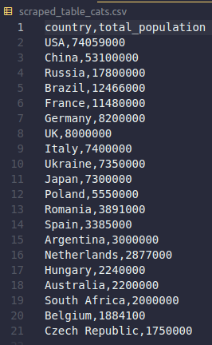

# Web Scraping With BeautifulSoup and Request

url = 'https://www.petsecure.com.au/pet-care/a-guide-to-worldwide-pet-ownership/'

### Task
- Pilih salah satu table Dog/Cat/Bird/Fish yang akan di scrap, kemudian buat python Jupyter Notebook untuk scrap data tersebut.


### Langkah - langkah
### `import module`
```python
import requests
from bs4 import BeautifulSoup 
import pandas as pd 
```
Berikut adalah library yang digunakan untuk melakukan scaping.
- Request: digunakan untuk requet HTTP Protocol.
- BeautifulSoup: digunakan untuk Parsing HTML.
- Pandas: digunakan untuk manipulasi data yang discrape.

### `Reqest HTTP menggunakan library request`

```python
url = 'https://www.petsecure.com.au/pet-care/a-guide-to-worldwide-pet-ownership/'
response = requests.get(url)

print(response)
```
Code diatas digunakan untuk melakukan request http pada url petsecure

### `Parse & Print HTML dengan Bs4`
```python
soup = BeautifulSoup(response.content, 'html.parser')

print(soup.prettify())
```
Code diatas digunakan untuk parsing html dan menampilkan nya di python

### `Mendapatkan Table Cats dan Header`
```python
cats = soup.find('div', {'class': 'table-holder clearfix'})

table = cats.find('table', {'class':'cats'})

x = table.find_all('th')
for i, y in enumerate(x):
  print(i, y)
  print(i, "text:", y.text)

headers = []
for th in table.find_all('th'):
    headers.append(th.text.strip())

print(headers)
```

Pada code diatas digunakan untuk mengambil table cats pada web. Berikut beberapa langkah yang dilakukan untuk mendapatkan table tersebut.
- Mengambil class dari table cats
- Mencari table dengan nama class `cats`.
- Mengambil semua header dari table

### `Mengambil Table Row Pada Table Casts`
```python
x = table.find_all('tr')
for i, y in enumerate(x):
  print(i, y.prettify())
  print(i, "text:", y.text)

data = []
for tr in table.find_all('tr'):
    row_data = []
    for td in tr.find_all('td'):
        row_data.append(td.text.strip())
    if len(row_data) > 0:
        data.append(row_data)
```
Code diatas digunakan untuk mengambil data table row. berikut beberapa langkahnya.
- Mencari tag `tr` untuk mendapatkan table row
- Mencari tag `td` dan melakukan looping untuk mendapatkan value setiap row

### `Menggabungkan Header dan Data ke dalam Dataframe`
```python
df = pd.DataFrame(data, columns = headers)
```


### `Transform Data`
- rename columns
```python
df = df.rename(columns={
        'TOP 20\nCAT POPULATIONS':'country',
        '':'total_population'
})
```


- Formatting Data Type
```python
df.info()
```

```python
# replace/menghapus koma
df['total_population'] = df['total_population'].str.replace(',', '') 

# mengubah tipe data menjadi
df['total_population'] = df['total_population'].astype(int) 
```






### `Load Dataframe to CSV`
```python
df.to_csv('scraped_table_cats.csv', index=False)
```
